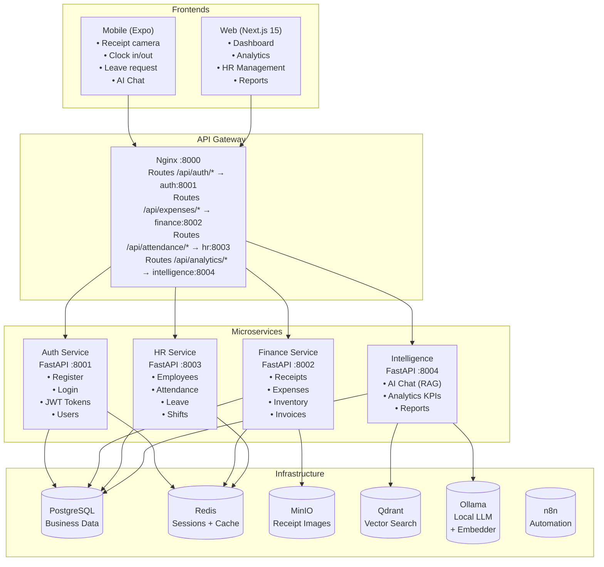

# ReceiptBuddy 📸

**AI-powered business management platform** — receipt scanning, expense tracking, smart shift scheduling, attendance & leave management, and AI business chat.

Built as a **microservices architecture** with shared common libraries for maximum code reuse and maintainability.

## Repository Structure

This is the **superproject** (main module) that orchestrates all submodules:

```
ReceiptBuddy/                          # ← You are here
├── common/                 → github.com/lqmnwido/ReceiptBuddy-library
├── services/auth/          → github.com/lqmnwido/ReceiptBuddy-auth
├── services/finance/       → github.com/lqmnwido/ReceiptBuddy-finance
├── services/hr/            → github.com/lqmnwido/ReceiptBuddy-hr
├── services/intelligence/  → github.com/lqmnwido/ReceiptBuddy-intelligence
├── gateway/                → github.com/lqmnwido/ReceiptBuddy-gateway
├── frontend-web/           → github.com/lqmnwido/ReceiptBuddy-web
├── mobile/                 → github.com/lqmnwido/ReceiptBuddy-mobile
├── docker-compose.yml      → github.com/lqmnwido/ReceiptBuddy-infra
└── README.md
```

Each submodule is its own **independent repository** with its own CI/CD and Docker image. The superproject pins compatible versions together for local development.

## Architecture



## Quick Start (Docker)

### Prerequisites
- [Docker](https://docs.docker.com/get-docker/) & [Docker Compose](https://docs.docker.com/compose/install/) (v2.20+)
- [Git](https://git-scm.com/) with submodule support

### 🚀 Run Everything

```bash
# Clone with submodules
git clone --recurse-submodules https://github.com/lqmnwido/ReceiptBuddy.git
cd ReceiptBuddy

# Build and start all services
docker compose build
docker compose up -d
```

This starts: **PostgreSQL, Redis, MinIO, Qdrant, Auth Service, Finance Service, HR Service, Intelligence Service, API Gateway, Frontend, and n8n**.

### Service URLs

| Service | URL | Description |
|---------|-----|-------------|
| API Gateway | http://localhost:8000 | Single entry point for all APIs |
| Auth Service | http://localhost:8001 | Registration, login, JWT |
| Finance Service | http://localhost:8002 | Receipts, expenses, inventory |
| HR Service | http://localhost:8003 | Employees, attendance, leave, shifts |
| Intelligence | http://localhost:8004 | AI chat, analytics, reports |
| Frontend | http://localhost:3000 | Next.js web application |
| n8n | http://localhost:5678 | Automation workflows |
| MinIO Console | http://localhost:9001 | File storage admin (user: receiptbuddy, pass: receiptbuddy123) |

### First-Time Setup

Once all services are running, register an admin user:

```bash
curl -X POST http://localhost:8000/api/auth/register \
  -H "Content-Type: application/json" \
  -d '{"email":"admin@test.com","password":"admin123","full_name":"Admin","role":"admin"}'
```

Then log in to get a JWT token:

```bash
curl -X POST http://localhost:8000/api/auth/login \
  -H "Content-Type: application/json" \
  -d '{"email":"admin@test.com","password":"admin123"}'
```

### Optional: Enable AI Features

This project uses **Ollama** running locally on your host machine (not in Docker).
Install Ollama from [ollama.com](https://ollama.com) and pull the required models:

```bash
# Pull the LLM and embedding models
ollama pull gemma4:e4b
ollama pull nomic-embed-text-v1.5
```

The microservices automatically connect to Ollama at `http://host.docker.internal:11434`.
Make sure Ollama is set to listen on all interfaces:

```bash
export OLLAMA_HOST=0.0.0.0
ollama serve
```

### Individual Services

Each microservice can be run independently (useful for development):

```bash
# Start only infrastructure
docker compose up -d postgres redis minio qdrant

# Start a specific service
docker compose up -d auth
```

## Development

### Working with Submodules

Each submodule is an independent repo. To contribute to a specific service:

```bash
# Work on the auth service
cd services/auth
git checkout main
git pull
# Make changes, commit, push to ReceiptBuddy-auth repo
git push origin main

# Back in the superproject, pin the new version
cd ../..
git add services/auth
git commit -m "chore: update auth submodule"
git push
```

### Running Without Docker

```bash
# Install common library locally
cd common
pip install -e .
cd ..

# Run a specific service (e.g., auth)
cd services/auth
pip install -r requirements.txt
PYTHONPATH=../.. uvicorn services.auth.app.main:app --reload --port 8001
```

### Frontend

```bash
cd frontend-web
cp .env.example .env.local
npm install
npm run dev
```

### Mobile

```bash
cd mobile
npm install
npx expo start
```

## Features

| # | Feature | Description |
|---|---------|-------------|
| 1 | 📸 Receipt Scanner | Snap photo → OCR → auto-extract vendor, date, total, items |
| 2 | 💰 Expense Tracker | Categorize, tag, track all business spending |
| 3 | 📊 Analytics Dashboard | Spending trends, category breakdown, KPIs |
| 4 | 🤖 AI Business Chat | Chat with your business data in plain English (RAG) |
| 5 | 📅 Smart Shift Scheduler | AI generates optimal shift schedules |
| 6 | ✅ Attendance Tracker | Clock in/out with GPS, breaks, overtime |
| 7 | 🩺 Leave Management | Sick, medical, annual, unpaid with approval flow |
| 8 | 👥 Employee Management | Profiles, roles, documents, performance notes |
| 9 | 🏪 Inventory Alerts | Low stock warnings, reorder triggers |
| 10 | 📈 Financial Reports | Monthly P&L, expense breakdown, payroll |
| 11 | 🔔 Smart Notifications | Shift reminders, leave status, low stock |
| 12 | 📄 Invoice Generator | Auto-generate invoices for clients |

## Tech Stack

- **Microservices**: 4 × FastAPI Python services (Auth, Finance, HR, Intelligence)
- **Shared Library**: `common/` package with models, schemas, repositories, security
- **Patterns**: Repository pattern, lazy singletons, service layer, dependency injection
- **Database**: PostgreSQL 16, SQLAlchemy 2.0 with session-per-service isolation
- **AI**: Ollama (gemma4), Qdrant (vector search), Tesseract OCR
- **Frontend**: Next.js 15, Tailwind CSS, Recharts
- **Mobile**: Expo (React Native), Expo Router, Camera API
- **Infrastructure**: Docker Compose, MinIO (S3), n8n (automation), Nginx (gateway)
- **Auth**: JWT with bcrypt (shared secret across services)

## Cloning

```bash
# Clone with all submodules
git clone --recurse-submodules https://github.com/lqmnwido/ReceiptBuddy.git
cd ReceiptBuddy

# Or if you already cloned without --recurse-submodules:
git submodule update --init --recursive
```

## Updating Submodules

```bash
# Pull latest from all submodules
git submodule update --remote

# Or a specific submodule
git submodule update --remote common
```

## Project Structure

```
ReceiptBuddy/                          # Superproject (submodule orchestrator)
├── common/                → 🧩 Submodule: Shared Python library
│   ├── config.py          → Pydantic BaseSettings
│   ├── database.py        → DatabaseManager, session factory
│   ├── security.py        → JWT + bcrypt
│   ├── dependencies.py    → FastAPI DI helpers
│   ├── exceptions.py      → Exception hierarchy
│   ├── models/            → 14 SQLAlchemy ORM models
│   ├── repositories/      → BaseRepository[T] + domain repos
│   └── schemas/           → Pydantic request/response schemas
├── services/
│   ├── auth/              → 🔐 Submodule: Auth Service (:8001)
│   ├── finance/           → 💰 Submodule: Finance Service (:8002)
│   ├── hr/                → 👥 Submodule: HR Service (:8003)
│   └── intelligence/      → 🤖 Submodule: Intelligence Service (:8004)
├── gateway/               → 🚪 Submodule: Nginx API Gateway
├── frontend-web/          → 🌐 Submodule: Next.js web app
├── mobile/                → 📱 Submodule: Expo React Native app
├── docker-compose.yml     → (from infra repo)
└── README.md
```

## API Overview

All endpoints are accessible through the API Gateway at http://localhost:8000.

| Endpoint | Service | Description |
|----------|---------|-------------|
| `POST /api/auth/register` | Auth | Register new user |
| `POST /api/auth/login` | Auth | Login → JWT token |
| `GET /api/auth/me` | Auth | Current user profile |
| `POST /api/receipts/upload` | Finance | Upload receipt image (OCR + AI) |
| `GET/POST /api/expenses` | Finance | Expense CRUD + summary |
| `GET/POST /api/inventory` | Finance | Inventory management |
| `GET/POST /api/invoices` | Finance | Invoice generation |
| `GET/POST /api/employees` | HR | Employee management |
| `POST /api/attendance/clock-in` | HR | Clock in with GPS |
| `POST /api/attendance/clock-out` | HR | Clock out |
| `POST /api/leave/requests` | HR | Submit leave request |
| `POST /api/shifts/generate` | HR | Generate shift schedules |
| `POST /api/ai/chat` | Intelligence | Chat with business data (RAG) |
| `GET /api/analytics/kpis` | Intelligence | Dashboard KPIs |
| `GET /api/reports/expenses` | Intelligence | Export CSV reports |

Full interactive docs at `/docs` when any service is running directly.

## OOP Design Patterns

The codebase uses several OOP patterns for maintainability:

1. **Repository Pattern**: `BaseRepository[T]` provides generic CRUD operations. Domain-specific repositories (`UserRepository`, `ExpenseRepository`, etc.) extend it with custom query methods.

2. **Lazy Singleton Pattern**: Services like `DatabaseManager`, `SecurityManager` initialize on first use via `get_database()`, `get_security()` — avoids import-time crashes.

3. **Template Method Pattern**: All FastAPI services share the same structure (main.py → lifespan → exception handlers → CORS → health check).

4. **Dependency Injection**: FastAPI's `Depends()` injects database sessions, current users, and authorization checks.

5. **Exception Hierarchy**: `ReceiptBuddyException` → `NotFoundException`, `ConflictException`, `UnauthorizedException`, etc. with automatic JSON serialization.

6. **Config Inheritance**: `ServiceSettings` is the base config; each service can add its own settings via `extra = "allow"`.

7. **Timestamped Models**: All models extend `TimestampedBase` with `id`, `created_at`, `updated_at` and auto-generated `__tablename__`.

## License

MIT — all runs locally, zero API costs.
